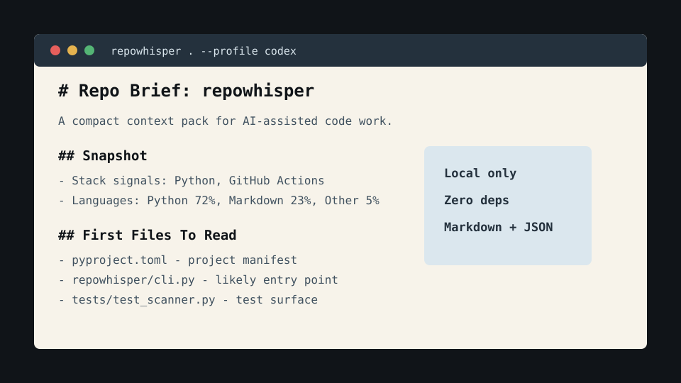

# RepoWhisper

[](https://github.com/DDDD-chen/repowhisper/actions/workflows/test.yml)

RepoWhisper turns a code repository into a compact, AI-ready project brief.

It is built for the moment before you ask Codex, Claude, Cursor, or another coding
agent to work in a repo and you want to give it the right context without pasting
the whole codebase.



```bash
python3 -m repowhisper .
python3 -m repowhisper . --write repowhisper.md --agents
python3 -m repowhisper . --format json
```

## Why it exists

Most coding-agent failures are not model failures. They are context failures:

- the agent sees the wrong files first
- local commands are hidden in a README footnote
- generated folders drown out the source tree
- the repo has conventions that never reach the prompt
- reviewers waste time explaining the same project shape again and again

RepoWhisper scans the repository locally and emits a concise brief with project
signals, file map, likely commands, test surface, risk notes, and a paste-ready
prompt pack.

No API key. No telemetry. No upload. Just local files in, Markdown or JSON out.

## What it generates

- Repository snapshot: file counts, byte size, languages, and detected stack
- High-signal file map with generated/vendor folders filtered out
- Manifest and command summary from common project files
- Test, docs, config, and CI surface
- Compact snippets from the files an agent should inspect first
- Optional `AGENTS.md` with repo-specific onboarding instructions
- JSON output for automation and dashboards

## Quick Start

From this repository:

```bash
python3 -m repowhisper . --write repowhisper.md --agents
```

From any other repository:

```bash
python3 -m pip install git+https://github.com/DDDD-chen/repowhisper.git
repowhisper /path/to/repo --write /path/to/repo/repowhisper.md
```

For a smaller brief:

```bash
repowhisper . --max-files 120 --max-snippet-lines 16
```

For automation:

```bash
repowhisper . --format json > repo-context.json
```

## CLI

```text
usage: repowhisper [path] [--write FILE] [--agents] [--format markdown|json]
                   [--max-files N] [--max-depth N] [--max-snippet-lines N]
                   [--include GLOB] [--exclude GLOB] [--profile NAME]
```

Options:

- `path`: repository path to scan, default is current directory
- `--write FILE`: write the brief to a file instead of stdout
- `--agents`: write or update `AGENTS.md` beside the brief
- `--format`: choose `markdown` or `json`
- `--profile`: tune wording for `codex`, `claude`, `cursor`, or `generic`
- `--max-files`: cap files included in the scan
- `--max-depth`: cap the rendered tree depth
- `--max-snippet-lines`: cap each included snippet
- `--include`: add one or more glob patterns to include
- `--exclude`: add one or more glob patterns to exclude

## Example Output

See [examples/demo.md](examples/demo.md) for a generated brief.

## How It Chooses Files

RepoWhisper ranks files by usefulness to a coding agent:

1. Agent and contributor instructions
2. Package manifests and lockfiles
3. Application entry points
4. Tests and CI configuration
5. Source files near the top of the project
6. Documentation

It skips common generated, dependency, cache, build, and media folders by default.
You can add project-specific filters with `--include` and `--exclude`.

## Design Principles

- Local first: source code never leaves your machine
- Fast enough for hooks and pre-PR checks
- Boring output: Markdown and JSON that humans can diff
- Agent useful: summarizes conventions and next inspection targets, not generic prose
- Zero runtime dependencies

## Roadmap

- Git diff mode for PR-specific context packs
- Secret and large-file redaction warnings
- Built-in model-specific prompt profiles
- `pre-commit` hook recipe
- Mermaid architecture sketch from import graph hints
- GitHub Action for keeping `repowhisper.md` current

## Contributing

Run tests:

```bash
python3 -m unittest discover -s tests
```

Generate the project brief:

```bash
python3 -m repowhisper . --write repowhisper.md --agents
```

Open an issue with a small sample repository shape when reporting scan quality
problems. Tiny fixtures beat long descriptions.

## License

MIT
